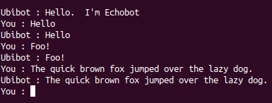

# ubibot tutorial
A friendly little bot for simple use anywhere.

This tutorial assumes:
* You are familiar with [node.js](https://nodejs.org) programming;
* You know what a conversational interface, or [chatbot](https://en.wikipedia.org/wiki/Chatbot), is.

## the API (part 1)
Ubibot is based around a single api:
```javascript
function respondTo(string: request) => Promise<string>: response
```
That's it really.  
Some points to note:  
- its implementation is asynchronous (it returns a Promise);
- but its usage is essentially synchronous - swapping strings in a request/response manner.

No delayed notifications, no fancy formats.  Ubibot has a deliberately simple API.

Well OK, there a couple of wrinkles:
1. Actually, in addition to ```respondTo```, the created bot object must have a ```hello``` method.  Its contract is also pretty simple:
    ```javascript
    function hello => Promise<string>: greeting
    ```
1. Your module must not export the functions direct, but instead a factory function that creates a bot object with a ```respondTo``` method:
    ```javascript 
    const hello = async() => 'Hello!';
    const respondTo = async(request) => {
     const response = ...;
     return response;
    };
 
    module.exports = () => ({ hello, respondTo });
    ```
So with that, you can write your first ubibot implementation...

## my first ubibot (part 1)
Let's make an echobot that repeats whatever the user says:
1. create a new node project with ```npm init```;
2. add an ```index.js``` file which exports a factory function; the factory function should create the echobot implementation:
    ```javascript
    const hello = async() => 'Hello.  I\'m Echobot';

    const respondTo = async(request) => request;
 
    module.exports = () => ({ hello, respondTo });
    ```
1. add [```@numical/ubibot-cli```](../packages/ubibot-cli) as a dev dependency:
    ```bash
    npm install -D @numical/ubibot-cli
    ```
1. this will make available a ```startCli``` script in ```.node_modules/.bin``` that you can reference in a ```package.json ``` script:
    ```json
    ...
    "scripts": {
       "start": "startCli index.js",
    },
    ...
    ``` 
1. run this and you should have your first Ubibot implementation:
    ```bash
    npm run start
    ``` 
1. It should look something like this:  
      
1. ```CTRL + C``` to exit. 


## the API (part 2)
You might have noticed the' _part 1_' suffix on the previous '_API_' section and been suspicious.  
Rightly so.  
The API has two _further_ wrinkles:
* state
* graceful exit

### state
The very far thinking might have been thinking about state.  
It's all very well have a trivial API that does not care what the user requested before.  
But if you do, or want to record side effects of what the user requests, you need to hold state.  
Easy enough in a single user situation - simply hold globally.  
But what about when your bot is so successful that more than one user wants to talk to it at once?  
Then you want to store state so that multiple conversations can be tracked and returned to.  
Hence there is a third, optional function to the ubibot API:
```javascript
function getState => Promise<object>: state
```
The hosting process can call this is at any time and expect a non-null (but possibly empty) object.  
By convention this should be readily serializable (```JSON.stringify```-able) , but that's really up to you and your persistence choices.  
This state object can then be passed to the factory function when creating a new bot object.  
The overall effect is to make your exported factory function look like this:
```javascript
module.exports = (state) => { hello, respondTo, getState };
```
In a multi-user situation, you create a new bot instance for each request/reply - not for each user conversation - using externally persisted state.     
For a reference implementation see the [ubibot-rest](../packages/ubibot-rest/lib/startReST.js) module.

### graceful exit
So far we have not talked about error handling.  
The API requirements are simple - ```Error```'s should never escape the ```respondTo``` (or ```hello```) methods.  
Your implementation should always capture them and convert to some friendly message to the user.  
And you should expect that the conversation might continue, so make sure your internal state is consistent.  
However how does a user gracefully exit a conversation?  
Again, that is up to your implementation - but having worked out the user wishes to quit, how does the bot object let the hosting process know?  
This is where the one exception to the 'No Error' rule comes in.  
Your implementation can throw a [```UserExit```](../packages/ubibot-util/lib/UserExit.js) error (well strictly speaking, return a rejected ```Promise```).  
The hosting process will then handle this by returning to the user the  [```UserExit.message```](../packages/ubibot-util/lib/UserExit.js) and then closing the conversation.  
There is no obligation to restart the conversation using a recorded state after a [```UserExit```](../packages/ubibot-util/lib/UserExit.js).


## my first Ubibot (part 1)
