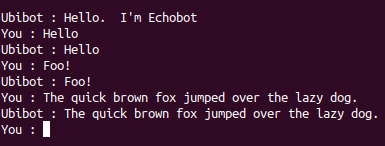
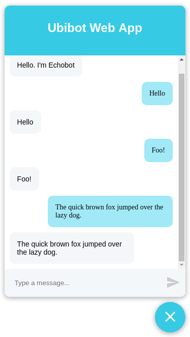

# ubibot tutorial
A friendly little bot for simple use anywhere.

This tutorial assumes:
* You are familiar with [node.js](https://nodejs.org) programming;
* You know what a conversational interface, or [chatbot](https://en.wikipedia.org/wiki/Chatbot), is.

## contents
* [core functions](#core-functions) - ```respondTo``` and ```hello```;
    * [my first ubibot (part 1)](#my-first-ubibot-part-1);
* [error handling and exiting](#error-handling-and-exiting)
    * [my first ubibot (part 2)](#my-first-ubibot-part-2);
* [testing](#testing])
    * [my first ubibot (part 3)](#my-first-ubibot-part-3)
* [multiple users and state](#mltiple-users-and-state)
    * [my first ubibot (part 4)](#my-first-ubibot-part-4)
* [next steps](#next-steps)

##core functions
Ubibot is based around a single api:
```javascript
function respondTo(string: request) => Promise<string>
```
That's it really.  
Some points to note:  
- its implementation is asynchronous (it returns a Promise);
- but its usage is essentially synchronous - swapping strings in a request/response manner.

No delayed notifications, no fancy formats.  Ubibot has a deliberately simple API.

Well OK, there a couple of wrinkles:
1. Actually, in addition to ```respondTo```, the created bot object must have a ```hello``` method.  Its contract is also pretty simple:
    ```javascript
    function hello() => Promise<string>
    ```
1. Your module must not export the functions direct, but instead a factory function that creates a bot object with a ```respondTo``` method:
    ```javascript 
    const hello = async() => 'Hello!';
    const respondTo = async(request) => {
     const response = ...;
     return response;
    };
 
    module.exports = () => ({ hello, respondTo });
    ```
So with that, you can write your first ubibot implementation...

## my first ubibot (part 1)
Let's make an echobot that repeats whatever the user says:
1. create a new node project with ```npm init```;
2. add an ```index.js``` file which exports a factory function; the factory function should create the echobot implementation:
    ```javascript
    const hello = async () => "Hello.  I'm Echobot";
    
    const respondTo = async request => request;
    
    module.exports = () => ({ hello, respondTo });
    ```
1. Add [```@numical/ubibot-cli```](../ubibot-cli) as a dev dependency:
    ```bash
    npm install -D @numical/ubibot-cli
    ```
1. This will make available a ```startCli``` script in ```.node_modules/.bin``` that you can reference in a ```package.json ``` script; point it at your factory function module:
    ```json
    ...
    "scripts": {
       "cli": "startCli index.js",
    },
    ...
    ``` 
1. Run this and you should have your first Ubibot implementation:
    ```bash
    npm run cli
    ``` 
1. It should look something like this:  
      
1. ```CTRL + C``` to exit. 
1. Is a CLI too old school for you?  Let's make a webapp instead:
1. Add [```@numical/ubibot-webapp```](../ubibot-webapp) as a dev dependency:
    ```bash
    npm install -D @numical/ubibot-webapp
    ```
1. Add another ```package.json``` script:
    ```json
    ...
     "scripts": {
       "cli": "startCli index.js",
       "web": "startWeb index.js"
     },
    ...
    ``` 
1. Run this and you should have your first Ubibot web-app:
    ```bash
    npm run web
    ``` 
1. It should look something like this:  
     
   (If you do not see anything check out the bottom right of the screen).
   
##error handling and exiting
###no error rule
The API requirements are simple.  
```Error```'s should never escape the ```respondTo``` (or ```hello```) methods.  
Your implementation should always capture them and convert to a friendly message to the user.  
And you should expect that the conversation might continue, so make sure your internal state is consistent.  
### graceful exit
However how does a user gracefully exit a conversation?  
Again, that is up to your implementation - but having worked out the user wishes to quit, how does the bot object let the hosting process know?  
This is where the one exception to the 'No Error' rule comes in.  
Your implementation can throw a [```UserExit```](../ubibot-util/lib/UserExit.js) error (well strictly speaking, return a rejected ```Promise```).  
The hosting process will then handle this by returning to the user the  [```UserExit.message```](../ubibot-util/lib/UserExit.js) and then closing the conversation.  
There is no obligation to restart the conversation using a recorded state after a [```UserExit```](../ubibot-util/lib/UserExit.js).

## my first ubibot (part 2)
So let's make our echobot a little more graceful.  
Let's make it echo the user's input, __unless__ that input is 'exit', in which case we close gracefully.  
1. Add [```@numical/ubibot-util```](../ubibot-util) as a dependency:
    ```bash
    npm install @numical/ubibot-util
    ```
1. Edit the ```respondTo``` method in ```index.js``` to look like this:
    ```javascript
    const { UserExit } = require('@numical/ubibot-util');

    const respondTo = async request => {
      if (request === "exit") {
        throw new UserExit("Bye!");
      } else {
        return request;
      }
    };
    ```
1. Run the CLI app again and you should be able to exit gracefully.  
1. The web app simply resets as this is the least offensive behaviour.


##testing
The framework's testing philosophy is:
* leave unit testing to the implementation - after all it is you, the implementor, who best knows the level of testing, you want;
* but offer powerful integration testing utilities.

One of the great advantages of conversational interfaces is that the user interaction is ```String``` in / ```String``` out.  
This makes writing test scripts easy, and the [```@numical/ubibot-test```](../ubibot-test) makes running them equally easy.


## my first ubibot (part 3)
1. Create a ```scripts``` directory in thr root of your project;
1. In this directory create a file called ```my_first_test_script``` (or any other name);
1. Add the following text content:
    ```bash
    bot:Hello. I'm Echobot
    user:Hello
    bot:Hello
    user:exit
    bot:Bye!
    ```
    Note the prefixes ```bot:``` and ```user:``` at the start of each line - important!
1. Now [```@numical/ubibot-cli```](../ubibot-cli) already exposes [```@numical/ubibot-test```](../ubibot-test) functionality so all you need do is add a ```package.json``` script:
    ```json
   ...
     "scripts": {
       "cli": "startCli index.js",
       "web": "startWeb index.js",
       "test": "testCli index.js scripts"
     },
    ...
    ```
    i.e.: run all the scripts found (recursively) in the ```scripts``` directory against the ubibot implementation exposd by ```index.js```;
1. Run it:
    ```bash
    npm run test
    ```    
1. It passes!  You have written a passing test first time! (Sorry, [Kent Beck](https://en.wikipedia.org/wiki/Kent_Beck#Books)).   
1. The [```@numical/ubibot-test```](../ubibot-test) has various other [formatting options](../ubibot-test/README.md#test-file-syntax) to make your test scripts more useful.
    

##multiple users and state
The very far sighted amongst you might have been thinking about _state_.  
It's all very well have a trivial API that does not care what the user said before.  
However in most conversations you do; you need to hold state.  
In a single user situation - simply hold it globally.  
In fact for many Ubibot use cases, you can stop here.  The single user case has no further API requirements.
   
But how about multi-user user cases?  
When your bot is so successful that more than one user wants to talk to it at once?  
Then you want to store state so that multiple conversations can be tracked.  
Hence there is a third, optional function to the ubibot API:
```javascript
function getState() => Promise<object>
```
The hosting process can call this is at any time and expect a non-null (but possibly empty) object.  
By convention this should be readily serializable (```JSON.stringify```-able) , but that's really up to you and your persistence choices.  
This state object can then be passed to the factory function when creating a new bot object.  
The overall effect is to make your exported factory function look like this:
```javascript
module.exports = (state) => { hello, respondTo, getState };
```
In a multi-user situation, you create a new bot instance for each request/reply - not for each user conversation - using externally persisted state.     
For a reference implementation see the [ubibot-rest](../ubibot-rest/lib/startReST.js) module.

## my first ubibot (part 4)
So let's first add some state.  
This is rather contrived, but let's report the number of times echobot replies.  
As we want to store state, we will now need explicit instances.
This is why we export a factory function, rather than an instance.  
Update ```index.js``` to return instances of a ```Bot``` class that implements the Ubibot API:
```javascript
const { UserExit } = require("@numical/ubibot-util");

class Bot {
  constructor() {
    this.replyCount = 0;
    this.respondTo = this.respondTo.bind(this);
  }
  async hello() {
    return "Hello.  I'm Echobot";
  }
  async respondTo(request) {
    if (request === "exit") {
      throw new UserExit("Bye!");
    } else {
      this.replyCount++;
      return `${request} (reply #${this.replyCount})`;
    }
  }
}

module.exports = () => new Bot();
```
Note the explicit ```bind``` of ```respondTo``` in the constructor.  
It's generally a good idea to ensure stateful instance's methods are bound, especially when you have no idea how they will be called in external libraries you do not control. 

Note also that your test script will now need changing!

OK - we now have state.  
Feel free to run this up in one of the single user environments:  
```bash
npm run cli
 AND/OR
npm run web
``` 
However the real proof-of-the-pudding is using this is in a multi-user environment.  
We can do this using two further Ubibot libraries.  
First, we will run up echobot on a server behind a [ReST](https://www.restapitutorial.com/) interface:

1. Add [```@numical/ubibot-rest```](../ubibot-rest) as a dev dependency:
    ```bash
    npm install -D @numical/ubibot-rest
    ```
1. Add another ```package.json``` script:
    ```json
    ...
     "scripts": {
       "cli": "startCli index.js",
       "web": "startWeb index.js",
       "test": "testCli index.js scripts"
       "rest": "startRest index.js"
     },
    ...
    ``` 
1. Run this and you should have your first Ubibot server:
    ```bash
    npm run rest
    ``` 
1. Not so interesting this time - just a server message reporting it is listening.  Note the port!

Second, we need clients to talk to this server.  
We will use Ubibot's [```@numical/webbot```](../webbot) library.  
This is a minimal Ubibot implementation based on  [```@numical/ubibot-webapp```](../ubibot-webapp) which simply asks you for the url of _another_ Ubibot implementation to run.  
Perfect for our needs!  
You will find it available at [https://numical.com/webbot](https://numical.com/webbot).  
Go there and open the chat interface, bottom right.  
Enter the URL for your echobot server - this will be ```http://localhost:{port}``` taking the port value from the server message earlier.  
Run up multiple tabs and wonder at the state being maintained on each.

## next steps
If you have got this far you might be feeling a little cheated.

We have covered various boilerplate libraries that give us testable, conversational interfaces.
But what about the actual conversations themselves?  So far we have been limited to echoing the user - something that can be done in a lot less code.   

This is deliberate.  The Ubibot ecosystem is there to help anyone who wants to go off and develop their own implementation of the ```respondTo``` API.  
Please do!

**Or...** you can take a look at Ubibot's suggested implementation - a non-AI system of contextualised heuristics backed by natural language understanding.  
Sounds cool?  It is meant to...  
If so, go sink your teeth into the real fun at [```@numical/ubibot-engine```](../ubibot-engine/README.md).

Thanks for reading so far.  
numical  
June 2019
