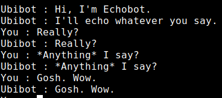

# ubibot-cli
Command Line Interface for ubibot.

Currently **alpha** code 

## installation
```bash
npm install @numical/ubibot-cli
```

## usage
A channel package that provides a Command Line Interface (CLI) to a single-user implementation of ubibot.  
This is not a standalone library.  
It must be used as a dependency in a 'domain' module such as [@numical/echobot](../echobot/README.md):
```javascript
const { startCLI } = require("@numical/ubibot-cli");
const configuration = ...

startCLI(configuration);
```
This will result in:



## testing
This also offers a test runner for the CLI channel:
```javascript
const { testCLI } = require("@numical/ubibot-cli");
const config = ...

testCLI("My Domain Tests", config);

```
See [@numical/ubibot-test](../ubibot-test/README.md) for more on using this test runner.

## api
This module exports 2 functions:

###```startCLI(config)```
* instantiates a single-user ubibot and starts a command line interface  
    __arguments__  
        - config (Object) : configuration object created using [@numical/ubibot-config](../ubibot-config/README.md)  
    __returns__  
    undefined - but a side effect is a spawned [repl](https://en.wikipedia.org/wiki/Read%E2%80%93eval%E2%80%93print_loop) process


###```testCLI(config)```
* instantiates a single-user ubibot and runs a test runner for use with [@numical/ubibot-test](../ubibot-test/README.md)  
    __arguments__  
        - name (String): display name for the test  
        - config (Object) : configuration object created using [@numical/ubibot-config](../ubibot-config/README.md)  
    __returns__  
    undefined


